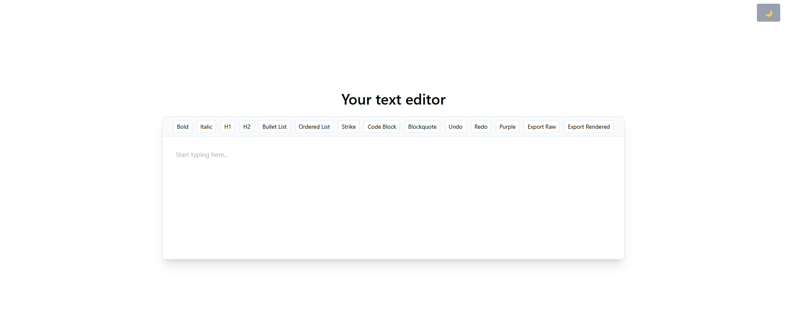
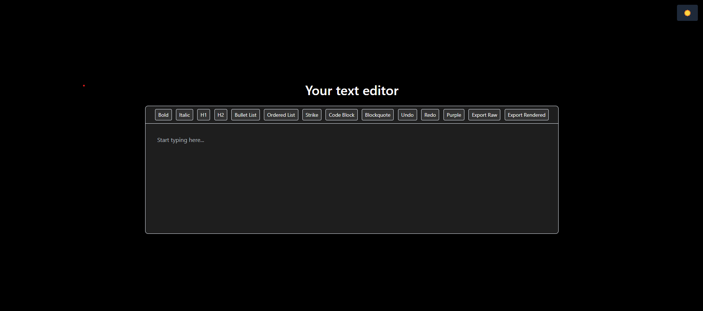
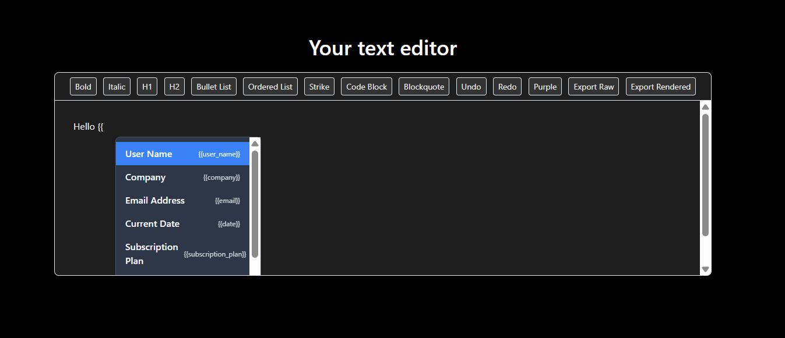
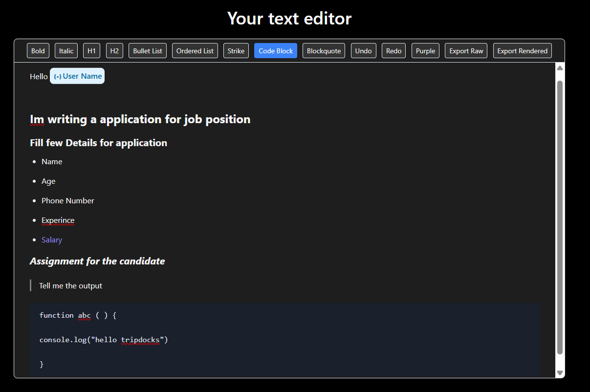
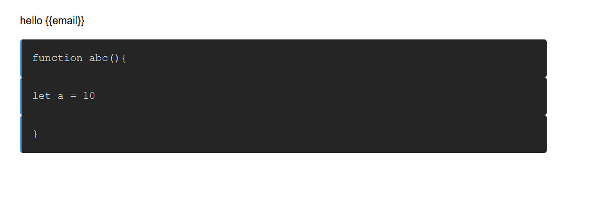
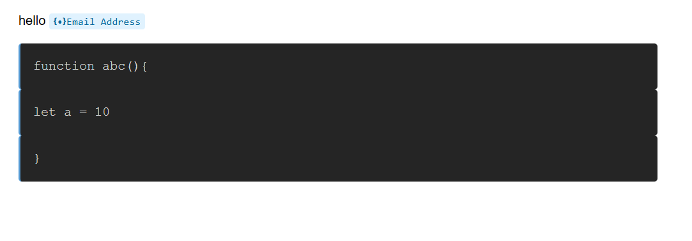

Text Editor using Tiptap with Suggestion Feature

Summary - A powerful rich text editor built with Tiptap and React that supports variables, dark mode, and HTML export capabilities.

# Features

Rich Text Editing: Full-featured WYSIWYG editor with formatting options

Variable Integration: Insert dynamic variables with {{ syntax

Dark/Light Mode: Automatic theme switching based on system preferences

Export Options: Export as raw HTML (with variables) or rendered HTML (with values)

Responsive Design: Works on desktop and mobile devices

Code Support: Syntax highlighting for code blocks

# Installation
Clone the repository:
cd text-editor

# Install dependencies:

1. npm install
# or
2. yarn install

# Start the development server:

1. npm start
# or
2. yarn start

# Usage

1. Basic Editing
Use the toolbar buttons to format text (bold, italic, headings, etc.)

2. Press Enter to create new paragraphs

3. Use Tab to indent lists

4. Variable Integration
Type {{ to open the variables menu

5. Use arrow keys to navigate variables

6. Press Enter to insert selected variable

7. Variables appear as ❴•❵variable_name in the editor

8. Export Options
* Raw Export: Preserves variables in {{variable}} format
* Rendered Export: Replaces variables with their actual values

# Dark Mode
The editor automatically switches between light and dark modes based on system preferences.

Dependencies
Tiptap - Editor framework

React - UI library

Tailwind CSS - Utility classes (if used)

# Working Flow

1. Switch Dark Mode

2. Suggestion Pop-up with smooth animation

3. A simple example which highlight all key functionality like Variable Insertion tile effect, Some text format like h1,h2, orderded list, colour change, block quote and code block section

4. Export content in raw(orginal as editor) and rendered (normal html text except code)

1. rendered : 
2. raw : 
